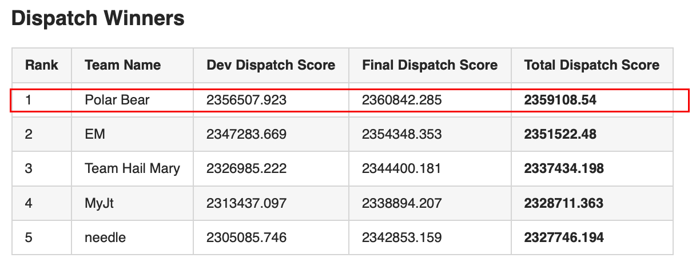

# Champion's Solution to KDD CUP 2020 RL Track (Learn to Dispatch)

To get to know the source code of our model, please see ./model/

Some preprocessing scripts can be seen in ./preprocessing/

To get to know the detail of our technique, please see description.pdf

To get to know the detail of our team staff, please see team.pptx

To get to know the detail of the contest, please see https://www.biendata.xyz/competition/kdd_didi/, ./competition_instruction/ also provide some infomation.

## Background and Dispatching Task of the Contest

With the rising prevalence of smart mobile phones in our daily life, Mobility-on-Demand (MoD), or online ride-hailing platforms have emerged as a viable solution to provide more timely and personalized transportation service, led by such companies as DiDi, Uber, and Lyft. These platforms also allow idle vehicle vacancy to be more effectively utilized to meet the growing need of on-demand transportation, by connecting potential mobility requests to eligible drivers. A more efficient MoD system offers better user experience for both driver and passenger groups: Drivers would be able to generate higher income through reduced idle time. Passengers would enjoy shorter waiting time and higher fulfillment rate. The efficiency of an MoD system basically hinges on how well the supply and demand distributions are aligned in both spatial and temporal spaces. There are two important problems for optimizing the operational efficiency of an MoD platform through regulating the supply distribution to better align with the demand: vehicle repositioning and order dispatching (matching). Order dispatching matches idle drivers (vehicles) to open trip orders, transporting passengers (and the drivers) to the trip destinations. Vehicle repositioning is a proactive measure, by deploying idle vehicles to a specific location in anticipation of future demand at the destination or beyond.
This KDD Cup competition focuses on developing intelligent strategies to increase the drivers’ income on an MoD platform through order dispatching and vehicle repositioning. Higher income for the drivers means better welfare, which in turn tends to translate better service for passengers.

#### Task: Order Dispatching

The team is to develop an algorithm to determine the order-driver assignment within a two-second dispatch window. The open orders (trip requests) and available drivers are batched in the window, and their state information will be passed to the order dispatching algorithm. This module will be called repeatedly for each dispatch window throughout the simulation day. The evaluation simulation runs over multiple `days’, from where the mean total driver income (defined in Evaluation) is computed as the score for the algorithm.

